# Descripción
Programa para realizar análisis de vulnerabilidades y generar un reporte automáticamente

Esto son solo los script del programa SimpleVulnerabilityManager, no es el programa completo. Para descargar el programa completo ir a:
https://www.simplevulnerabilitymanager.com

--
# Description
Program to perform vulnerability analysis and automatically generate a report

These are just the SimpleVulnerabilityManager program script, it is not the complete program. To download the complete program go to: https://www.simplevulnerabilitymanager.com

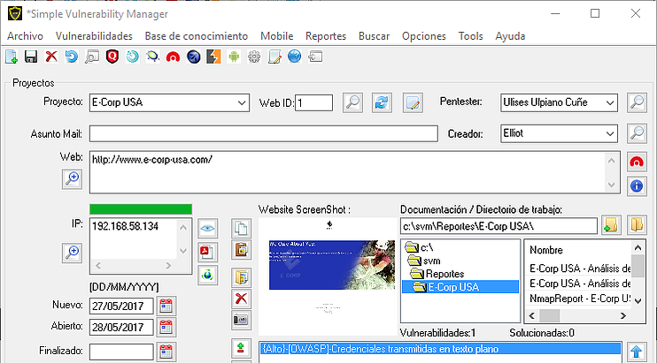
--
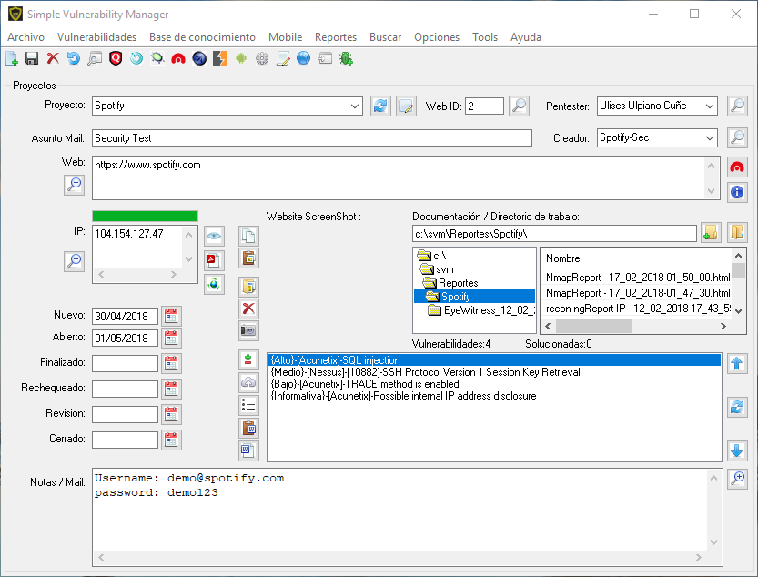
--
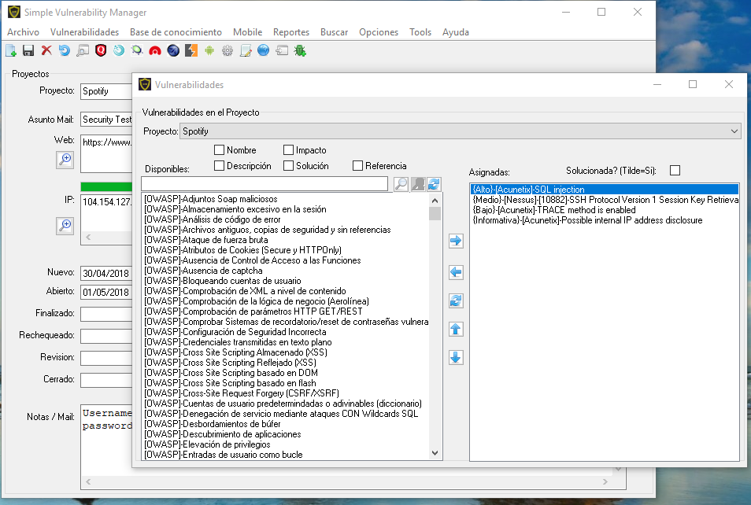
--
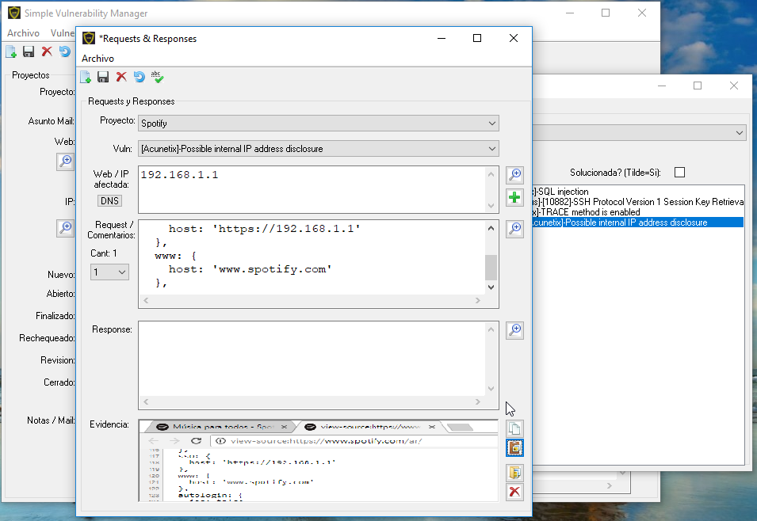
--
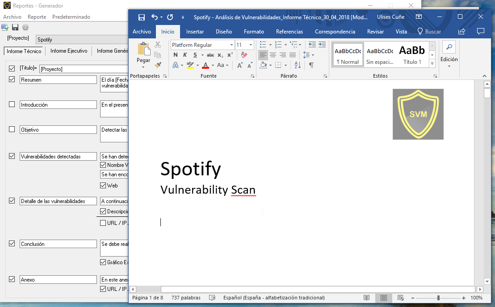
--
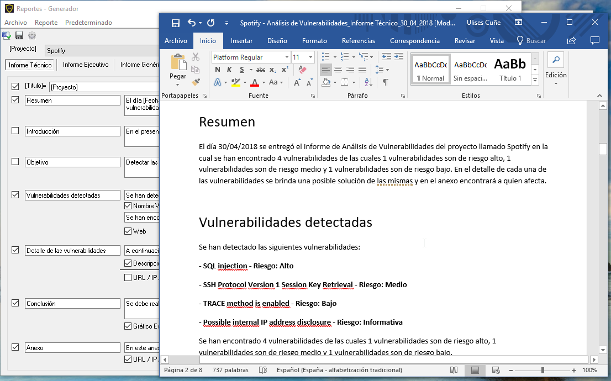
--
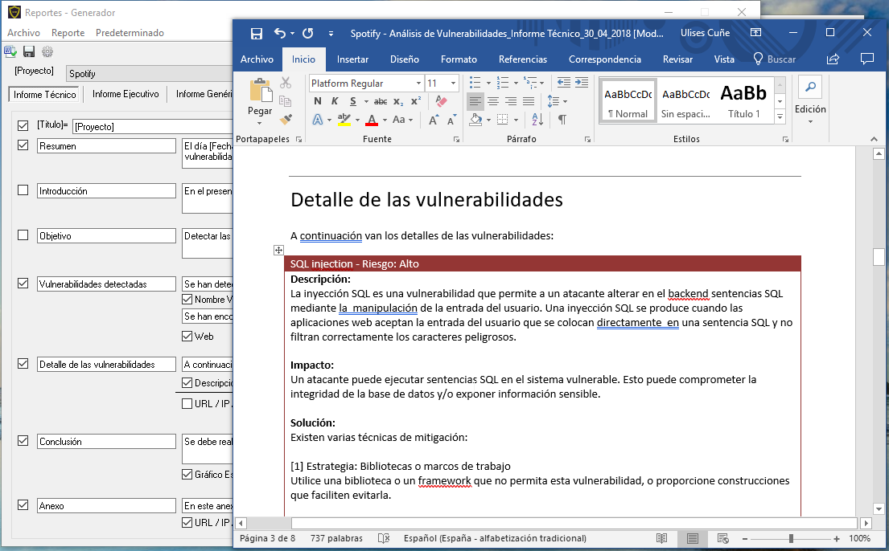
--
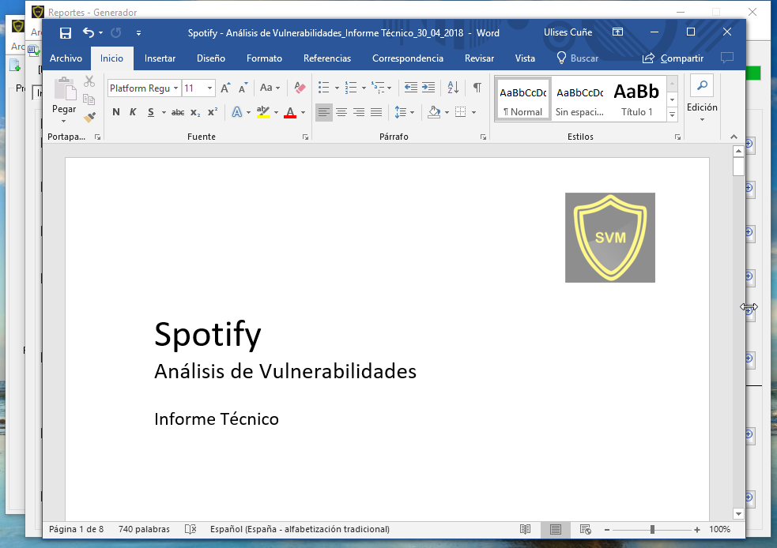
--
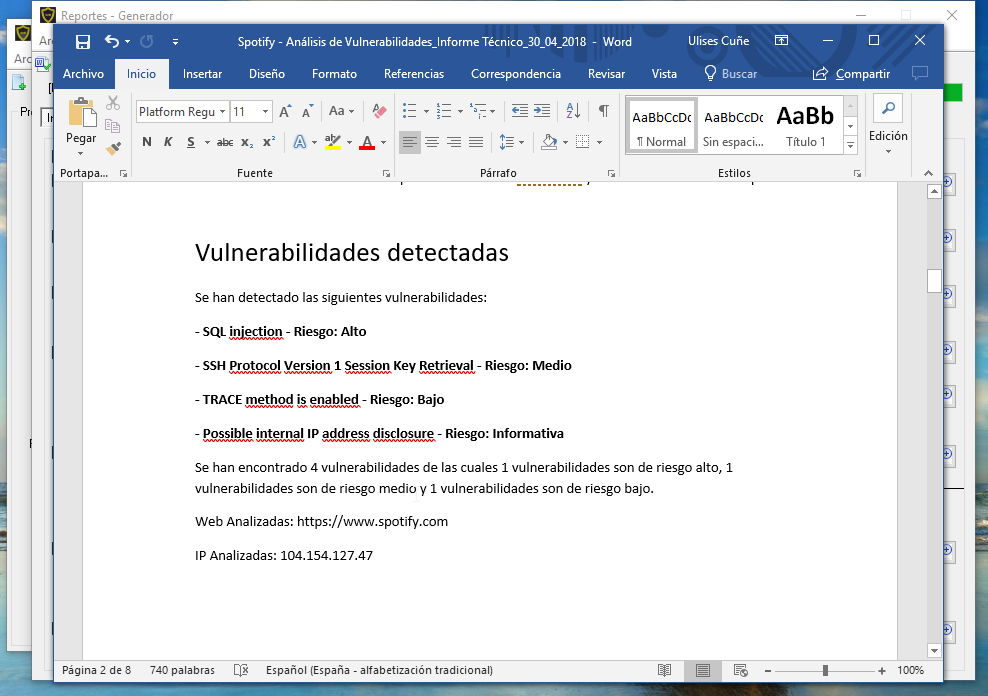
--
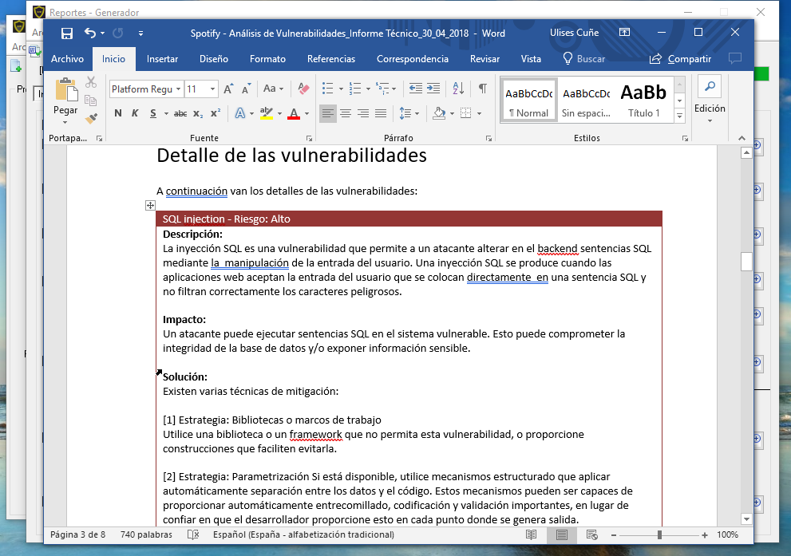
--
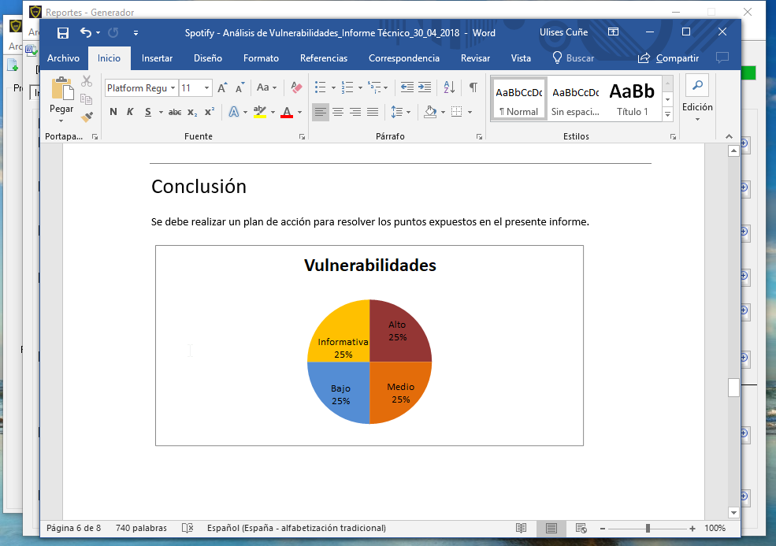
--
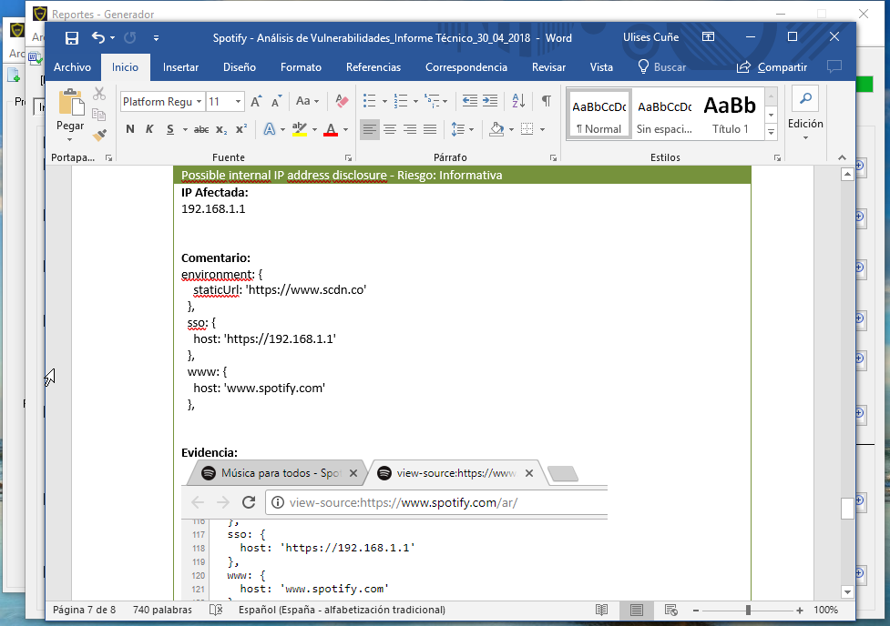

