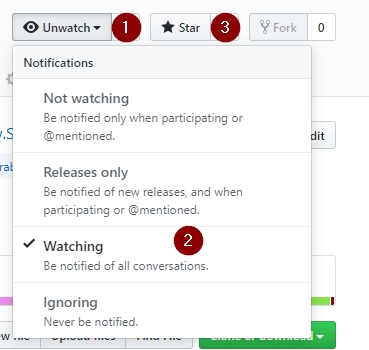

[Spanish](README.md) | English | [Russian](README_rus.md)

# Simple Vulnerability Manager

# Description
Simple Vulnerability Manager is the perfect tool for any vulnerability analyst, who with just a couple of clicks can perform a complete analysis of the weaknesses of a system of them. These vulnerabilities may be causing.

This application includes a database that contains the vast majority of vulnerabilities that a computer can suffer, organized in **Web Scanners**, **Service Scanners**, **Static Scanners** and **Mobile**. Within these sections, along with the relevant vulnerability, users can find a brief description that specifies what creates the problem, the impact it has on the system and the steps to be followed to solve it.

One of the most interesting features of Simple Vulnerability Manager is the ability to create and manage projects to clients who are being followed. These projects will be used to add personalized comments and screenshots that will serve as an individual test for each of the vulnerabilities that have been detected on the web and IP addresses.

# Installation
It's very simple, download the installer from https://www.simplevulnerabilitymanager.com and follow the instructions. You do not have to configure anything to start using immediately.

# Screenshots

Main screen

List of vulnerabilities available to add to the project.

# Tools

Simple Vulnerability Manager integrates with all the following external tools to be able to execute them quickly with a single click, which allows you to save time in the execution of the automated scans.

**Web Scanner**

* [Acunetix](https://www.acunetix.com/)

* [Burpsuite](https://portswigger.net/burp)

* [Netsparker](https://www.netsparker.com/)

* [Arachni Web Application](https://www.arachni-scanner.com/)

**Services Scanner**

* [Qualys Community](https://www.qualys.com/community-edition/) y Qualys Enterprise

* [Nessus](https://www.tenable.com/products/nessus/nessus-professional)

* [OpenVAS](http://www.openvas.org/)

* [Nmap](https://nmap.org/)

**Android Tools**

* [ApkTools](https://ibotpeaches.github.io/Apktool/)

* [Enjarify](https://github.com/google/enjarify)

* [JD-Gui](http://jd.benow.ca/)

* [MobSF](https://github.com/MobSF/Mobile-Security-Framework-MobSF)

* [QARK](https://github.com/linkedin/qark)

* [AndroBugs_Framework](https://github.com/AndroBugs/AndroBugs_Framework)

* [Uber Apk Signer](https://github.com/patrickfav/uber-apk-signer)

**Information Tools**

* [Recon-ng](https://bitbucket.org/LaNMaSteR53/recon-ng)

* [EyeWitness](https://github.com/ChrisTruncer/EyeWitness)

# Frequently Asked Questions and Answers (FAQ)

[Wiki](https://github.com/simplevulnerabilitymanager/svm/wiki)

# Presentations

Simple Vulnerability Manager was presented at the following Computer Security Conferences

* [Ekoparty Security Conference](https://www.ekoparty.org) : Ekolabs [2016](https://twitter.com/SimpleVulnManag/status/792072988204134402)

* [Andsec Security Conference](https://www.andsec.org) : [2017](https://twitter.com/SimpleVulnManag/status/871576216112963586)

* [Spotify - Secure Podcast](https://open.spotify.com/episode/76DLj25Z3gWWFnfTlbpNrN): Episodio 012 (Minuto 48:40) - Las Vegas [2018](https://open.spotify.com/episode/76DLj25Z3gWWFnfTlbpNrN)

# Links

Follow me on social networks to be aware of the news

* Twitter: [@SimpleVulnManag](https://twitter.com/SimpleVulnManag) 

* Facebook: [@SimpleVulnerabilityManager](https://www.facebook.com/simplevulnerabilitymanager)

* Instagram: [@SimpleVulnerabilityManager](https://www.instagram.com/simplevulnerabilitymanager/)

* Youtube: [Canal](https://www.youtube.com/channel/UCDXH-m2SqQsnb91UUsQxlrQ?view_as=subscriber)

* GitHub: 

* Homepage: [www.SimpleVulnerabilityManager.com](https://www.simplevulnerabilitymanager.com/)

# License
Only the scripts for Windows (.bat) and the scripts for Linux (.sh) are OpenSource with GPL license, the rest of the programs have their respective licenses.

The executable "svm.exe" is a freeware license and should only be used for personal use. For use in companies, the **Pro** license must be purchased from SVM. More info to [contacto@simplevulnerabilitymanager.com] (mailto: contacto@simplevulnerabilitymanager.com) and at [www.SimpleVulnerabilityManager.com] (https://www.simplevulnerabilitymanager.com/)

